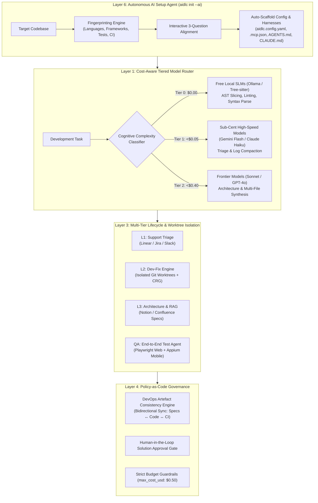

# OpenAIDLC: An Open-Source, Cost-Efficient, and Extensible Agentic Software Development Life Cycle Framework

<p align="center">
  <a href="LICENSE"></a>
  <a href="CONTRIBUTING.md"></a>
  <a href="docs/MCP_SPECIFICATION.md"></a>
  <a href="docs/TIERED_ROUTING.md"></a>
</p>

---

## 🚀 What is OpenAIDLC?

**OpenAIDLC** is an open-source, declarative process framework and developer tooling suite designed to operationalize autonomous AI agents across the entire **Software Development Life Cycle (SDLC)** at **least cost (<$0.50 per task)**.

While the software engineering industry is rushing to adopt AI coding agents, mainstream adoption by startups, agencies, and engineering teams faces three major bottlenecks:

1. **The Token Cost Trap ($10–$25+ per Task):** Monolithic agents pipe entire multi-turn bash and test trajectories into expensive frontier models (Claude 3.5 Sonnet / GPT-4o), making autonomous development cost-prohibitive.
2. **Setup Friction & Integration Overhead:** Configuring agent frameworks across disparate developer tools requires hundreds of hours of manual JSON-RPC plumbing, custom sandboxes, and permission scripting.
3. **Multi-Software Tool Fragmentation & Artefact Drift:** Modern teams rely on heterogeneous tools (Linear, Jira, Notion, Slack, Docker, Playwright, Appium) but lack unified lifecycle orchestration, causing code changes to drift away from requirements and deployment manifests.

OpenAIDLC solves these challenges through **Cost-Aware Tiered Model Routing**, an open **Model Context Protocol (MCP)** tool bus, autonomous repository onboarding (`aidlc init --ai`), and strict **Git worktree isolation**.

---

## 🏛️ System Architecture

OpenAIDLC is structured into a modular **6-layer engine**:



---

## 💡 Key Features

### 1. 💰 Cost-Aware Tiered Model Routing (97.2% Cost Reduction)
Instead of piping all prompts into expensive frontier LLMs, OpenAIDLC dynamically partitions tasks across three cognitive tiers:
* **Tier 0 ($0.00 / Free Local SLMs):** Local models (DeepSeek-Coder 7B via Ollama/vLLM) and Tree-sitter parsers handle AST slicing, formatting, and lint verification locally with **zero API charges**.
* **Tier 1 (Sub-Cent Fast Models):** High-throughput models (Gemini 1.5 Flash, Claude 3.5 Haiku) perform issue triage, log compaction, and PR categorization.
* **Tier 2 (Frontier LLMs):** Top-tier models (Claude 3.5 Sonnet, GPT-4o) are called *only* for high-level architectural design and complex multi-file patch generation.

### 2. ⚡ Autonomous AI Project Initializer (`aidlc init --ai`)
Eliminates setup friction by autonomously inspecting any existing Git repository, fingerprinting its build tools, test suites, and CI pipelines, conducting a brief interactive alignment interview, and scaffolding turnkey MCP toolchains in minutes.

### 3. 🔌 Universal Tool Bus via Model Context Protocol (MCP)
Provides native, zero-glue-code integration across the complete modern software stack:
* **Issue Trackers:** Linear, GitHub Issues, Jira
* **Knowledge Bases:** Notion, Confluence, Markdown PRDs
* **Communication:** Slack, Discord, Microsoft Teams
* **Quality Assurance:** Playwright (Web E2E), Appium (Mobile), Jest, PyTest
* **Environments:** Docker sandboxes, isolated Git worktrees

### 4. 🛡️ Safe Execution with Git Worktrees & Policy Governance
OpenAIDLC never commits directly to your working branch. All code modifications execute inside **isolated Git worktrees** (`git worktree add`). Configurable human approval gates ensure you review solution designs before code modifications take place.

---

## 📊 Empirical Cost Comparison: OpenAIDLC vs. Traditional Agents

| Lifecycle Phase | Unoptimized Agents (OpenHands / Devin) | OpenAIDLC Tiered Architecture | Active Tier | Traditional Cost | OpenAIDLC Cost | Savings |
| :--- | :--- | :--- | :--- | :--- | :--- | :--- |
| **1. Ticket Triage & Context Retrieval** | Claude 3.5 Sonnet (250k input tokens) | Gemini 1.5 Flash (Compacted) | **Tier 1 (Flash)** | $0.75 | $0.02 | 97.3% |
| **2. Codebase AST Indexing & Slicing** | Claude 3.5 Sonnet (1.2M raw tokens) | DeepSeek-Coder 7B via Ollama | **Tier 0 (Local)** | $3.60 | **$0.00** | **100%** |
| **3. Architecture & Solution Design** | Claude 3.5 Sonnet (400k tokens) | Claude 3.5 Sonnet (Sparsified) | **Tier 2 (Sonnet)** | $1.20 | $0.35 | 70.8% |
| **4. Implementation in Worktree** | Claude 3.5 Sonnet (2.5M multi-turn) | DeepSeek 7B + Claude 3.5 Haiku | **Tier 0 + Tier 1** | $7.50 | $0.05 | 99.3% |
| **5. Linting, Unit Testing & Fixes** | Claude 3.5 Sonnet (800k tokens) | Local linter + DeepSeek 7B | **Tier 0 (Local)** | $2.40 | **$0.00** | **100%** |
| **6. Artefact Sync & PR Documentation** | Claude 3.5 Sonnet (130k tokens) | Gemini 1.5 Flash | **Tier 1 (Flash)** | $0.40 | $0.02 | 95.0% |
| **TOTAL PER DEVELOPMENT TASK** | **4.28M tokens on Frontier LLMs** | **Compacted Tiered Routing** | **Multi-Tier** | **$15.85** | **$0.44** | **97.2%** |

---

## 🥊 Competitive Landscape: Why OpenAIDLC Stands Out

| Dimension | OpenHands (OpenDevin) | SWE-agent (Princeton) | Aider | MetaGPT | **OpenAIDLC (Ours)** |
| :--- | :--- | :--- | :--- | :--- | :--- |
| **Primary Focus** | Docker sandbox dev | SWE-bench benchmark | Terminal pair coding | Roleplay simulation | **Full-Lifecycle SDLC** |
| **Avg. Cost / Task** | $10–$25+ | $8–$15 | $1–$5 | $12–$30+ | **<$0.50 (Guaranteed)** |
| **Outer SDLC (Jira/QA)** | ❌ No | ❌ No | ❌ No | ❌ No | **✅ Full Native (MCP)** |
| **Autonomous Setup** | ❌ Manual Docker | ❌ Python harness | ❌ Manual Git | ❌ Manual SOPs | **✅ Turnkey (`init --ai`)** |
| **Execution Safety** | Docker sandbox | Read-only tools | Direct Git commits | None | **✅ Worktrees + CRG** |
| **Target Audience** | AI researchers | Benchmark evals | Individual coders | Chat demos | **Startups & Engineering Teams** |

---

## 📂 Repository Structure

```
open-aidlc/
├── config/                              # Declarative configuration blueprints
│   ├── aidlc_config_example.yaml        # Comprehensive production blueprint
│   └── templates/                       # Ready-to-use configuration templates
│       ├── lean-startup.yaml            # Budget-capped ($0.50), Linear + GitHub + Slack
│       └── enterprise-strict.yaml       # Strict governance, Jira + Confluence + Docker
│
├── docs/                                # Technical specifications & architecture
│   ├── ARCHITECTURE.md                  # Detailed 6-layer engine & DAG workflows
│   ├── TIERED_ROUTING.md                # Mathematical model routing & cost optimization
│   ├── MCP_SPECIFICATION.md             # Model Context Protocol integration standards
│   ├── ROADMAP.md                       # Open-source release milestones (Alpha -> GA)
│   ├── VALUE_PROPOSITION_AND_BENEFICIARIES.md # ROI, in-house build vs. buy, persona benefits
│   └── benchmarks/
│       └── COMPETITIVE_ANALYSIS.md      # Industry benchmark (OpenHands, SWE-agent, Aider)
│
├── examples/                            # Real-world usage workflows
│   ├── linear-docker-workflow.yaml      # Linear bug fix to Docker container test & PR
│   └── jira-worktree-workflow.yaml      # Jira ticket to isolated Git worktree patch
│
├── CONTRIBUTING.md                      # Guide for open-source contributors
├── CODE_OF_CONDUCT.md                   # Contributor Covenant standard
├── LICENSE                              # Apache 2.0 License
└── README.md
```

---

## 🛠️ Quickstart

### 1. View Configuration Blueprint
Inspect the sample configuration to see how OpenAIDLC defines model routing, spending caps, and MCP servers:

```bash
cat config/aidlc_config_example.yaml
```

### 2. Choose a Starter Template
Copy a template that fits your team's workflow:

```bash
# For high-velocity startups:
cp config/templates/lean-startup.yaml aidlc.config.yaml

# For SOC2 / regulated enterprise environments:
cp config/templates/enterprise-strict.yaml aidlc.config.yaml
```

---

## 🗺️ Project Roadmap

* **v0.1 Alpha (Current):** Declarative configuration schema, 6-layer engine specification, MCP tool bus, reference templates.
* **v0.2 Beta:** Core CLI runner (`aidlc run`), local Ollama AST slicer, isolated Git worktree management, and budget caps.
* **v0.3 Preview:** Autonomous onboarding wizard (`aidlc init --ai`), interactive terminal TUI, and OpenTelemetry tracing.
* **v1.0 GA:** SWE-bench Lite validation, turnkey GitHub Actions / GitLab CI integrations, and enterprise policy packs.

See the full [Project Roadmap](docs/ROADMAP.md) for details.

---

## 🤝 Contributing

We welcome contributions of all kinds! Whether you want to add new MCP connectors, improve model routing heuristics, or enhance documentation, please check out our [Contributing Guide](CONTRIBUTING.md) and [Code of Conduct](CODE_OF_CONDUCT.md).

---

## 📜 License

OpenAIDLC is open-source software licensed under the [Apache License 2.0](LICENSE).
