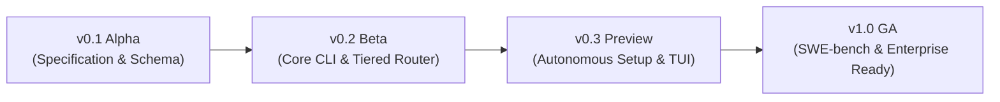

# OpenAIDLC Project Roadmap

This document outlines the development roadmap and milestone targets for the **OpenAIDLC** open-source project.

---

## 📍 Milestones

### Phase 1: v0.1 Alpha — Core Architecture & Specification (Current)
* [x] Formalize declarative configuration schema (`aidlc.config.yaml`).
* [x] Specify 6-layer customizability engine and DAG workflow runner.
* [x] Formalize Tiered Model Routing algorithm (<$0.50 / task).
* [x] Define Model Context Protocol (MCP) tool bus specification.
* [x] Provide enterprise and startup reference templates under `config/templates/`.
* [x] Publish open-source repository under Apache 2.0 license.

---

### Phase 2: v0.2 Beta — Core CLI & Routing Implementation
* [ ] Implement core `aidlc` CLI runner in Go / Python.
* [ ] Implement `TieredModelRouter` with local Ollama / vLLM support (Tier 0).
* [ ] Build isolated Git worktree management module (`git worktree add`).
* [ ] Implement Tree-sitter AST slicer for Python, TypeScript, and Go.
* [ ] Add basic cost tracking and budget caps (`max_cost_usd_per_task`).

---

### Phase 3: v0.3 Preview — Autonomous AI Onboarding & Interactive TUI
* [ ] Build `aidlc init --ai` autonomous repo fingerprinting agent.
* [ ] Implement interactive 3-question alignment wizard in terminal (Bubbletea / Inquirer).
* [ ] Build dual-runtime compilation engine (`AGENTS.md`, `CLAUDE.md`, `.cursorrules`).
* [ ] Add OpenTelemetry distributed tracing for multi-step agent DAGs.
* [ ] Implement pre-commit Code Review Graph (CRG) blast-radius calculation.

---

### Phase 4: v1.0 GA — Production Hardening & Benchmarking
* [ ] Benchmark on **SWE-bench Lite** to validate resolution rate vs. dollar cost.
* [ ] Validate on 20+ open-source startup and enterprise repositories.
* [ ] Release turnkey GitHub Actions / GitLab CI integrations.
* [ ] Support multi-tenant enterprise audit logging and SOC2 policy packs.
* [ ] Community plugin registry for custom MCP tool connectors.
