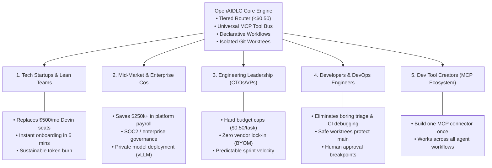

# OpenAIDLC: Value Proposition, ROI & Beneficiary Analysis

> **Why OpenAIDLC? The Business & Engineering Case for Standardizing Agentic SDLC**

---

## 1. The Industry Dilemma: The "In-House Agent Framework" Trap

Today, software engineering organizations are acutely aware that autonomous AI agents represent the future of software development. In response, hundreds of engineering teams make the same costly mistake: **they try to build their own in-house agentic framework from scratch.**

### The Hidden Cost of "Building It In-House"

```
┌────────────────────────────────────────────────────────────────────────┐
│              The 6-Month In-House Framework Build Trap                 │
├────────────────────────────────┬───────────────────────────────────────┤
│ Required In-House Engineering  │ Typical Payroll Cost                  │
├────────────────────────────────┼───────────────────────────────────────┤
│ 2 Senior Platform Engineers    │ 2 × $150,000 × (6/12) = $150,000      │
│ 1 Staff Architect (50% time)   │ 1 × $200,000 × 0.5 × (6/12) = $50,000 │
│ 1 DevOps / QA Engineer         │ 1 × $120,000 × (6/12) = $60,000       │
├────────────────────────────────┴───────────────────────────────────────┤
│ TOTAL SUNK COST: $260,000+ in developer payroll alone                  │
└────────────────────────────────────────────────────────────────────────┘
```

### What In-House Teams Actually End Up With:
1. **Fragile Custom Plumbing:** Brittle custom scripts connecting Jira, Slack, and GitHub that break whenever upstream APIs change.
2. **Model Vendor Lock-in:** Code tightly coupled to a single proprietary SDK (e.g., hardcoded to OpenAI function calling or Anthropic tool use).
3. **Runaway Token Bills:** Lacking a tiered routing algorithm, the in-house agent pipes entire multi-turn conversations into frontier LLMs, generating unexpected **$5,000–$15,000 monthly API invoices**.
4. **Maintenance Drain:** The platform team becomes permanent babysitters of an internal tool rather than shipping customer-facing features.

---

## 2. Who Benefits from OpenAIDLC and How?



---

### Persona 1: Tech Startups & Seed/Series A Teams (<50 Engineers)
* **The Problem:**
  * Cannot justify paying $500/seat/month for black-box proprietary platforms like Cognition Devin.
  * Cannot afford unoptimized open-source agents (OpenHands) that burn $15–$25 per task in OpenAI/Anthropic API credits.
  * Do not have spare engineers to build an internal agent harness.
* **How OpenAIDLC Solves It:**
  * **Instant Turnkey Setup:** Run `aidlc init --ai` on day one. The agent fingerprints the codebase and scaffolds workflows in minutes.
  * **Guaranteed Budget Discipline:** With Tiered Model Routing, routine bugs and PRs are resolved for **under $0.50**, saving 97% of LLM costs.
  * **Native Stack Integration:** Connects out-of-the-box to Linear, GitHub, and Slack via MCP.

---

### Persona 2: Mid-to-Large Enterprises & Platform Teams (50–1,000+ Engineers)
* **The Problem:**
  * The Platform / Developer Experience (DevEx) team has been tasked with "rolling out an internal AI developer tool."
  * Security and compliance teams reject cloud-only agents that lack SOC2 audit trails or demand full repository access to untrusted third-party servers.
  * Engineering cannot tolerate rogue AI agents pushing breaking changes or violating coding guidelines on `main`.
* **How OpenAIDLC Solves It:**
  * **Saves $250,000+ and 6 Months of Reinventing the Wheel:** Provides a battle-tested, open-source core framework so platform teams don't have to build agent orchestration from scratch.
  * **Policy-as-Code & Enterprise Governance:** Set strict rules via `aidlc.config.yaml` (`mode: "strict"`, `require_human_approval_before_push: true`).
  * **Private Models & On-Prem Support:** Connects natively to internal vLLM/Ollama clusters or Azure OpenAI endpoints without sending proprietary intellectual property to public clouds.
  * **Isolated Worktrees:** All agent modifications run in ephemeral `git worktree` branches, leaving production branches untouched until automated tests pass and developers approve.

---

### Persona 3: Engineering Leaders (CTOs, VPs of Engineering, Heads of DevEx)
* **The Problem:**
  * **Runaway Cloud Costs:** Uncontrolled agent loops can rack up thousands of dollars in a single weekend.
  * **Vendor Lock-in:** Hesitant to tie the entire corporate SDLC to a single LLM vendor that could increase prices or deprecate models.
  * **Code Quality & Technical Debt:** Fear that AI-generated code will introduce architectural drift and unmaintainable hallucinations.
* **How OpenAIDLC Solves It:**
  * **Hard Spending Guardrails:** Enforces `max_cost_usd_per_task: 0.50` at the engine level. Agents cannot exceed budgets.
  * **Bring-Your-Own-Model (BYOM):** Seamlessly switch between Anthropic Claude, Google Gemini, OpenAI GPT, and local open-source models (DeepSeek, CodeLlama) with one line in YAML.
  * **DevOps Artefact Consistency:** Enforces bidirectional synchronization between issue tickets, architecture design specs, code changes, and CI manifests.

---

### Persona 4: Individual Software Engineers & DevOps Practitioners
* **The Problem:**
  * Engineers spend 40%+ of their working hours on low-value chores: triaging incoming bug reports, reading 5,000-line CI build logs, generating boilerplate test mocks, and writing release notes.
  * Distrust of AI assistants that silently modify files or hallucinate non-existent libraries.
* **How OpenAIDLC Solves It:**
  * **Automated Support & Triage (L1):** Automatically ingests error logs, reproduces bugs, and identifies affected files before a human even opens the ticket.
  * **Human-in-the-Loop Approval:** The agent presents an architectural design plan and an uncommitted `git diff` for review before applying changes.
  * **Automated Test Generation:** Generates end-to-end integration tests (Playwright web, Appium mobile) to prove fixes work.

---

### Persona 5: Dev Tool Creators & MCP Ecosystem Partners
* **The Problem:**
  * Tool vendors (monitoring, issue tracking, databases) currently have to build separate proprietary plugins for every different agent tool.
* **How OpenAIDLC Solves It:**
  * By building on the open **Model Context Protocol (MCP)**, any tool that supports MCP works instantly with OpenAIDLC. No custom SDK or plugin development needed.

---

## 3. Financial Comparison: Build vs. Buy vs. OpenAIDLC

| Dimension | Proprietary Agents (e.g. Devin) | Build In-House Framework | OpenAIDLC Open Source |
| :--- | :--- | :--- | :--- |
| **Initial Setup Time** | 1–2 Weeks | **4–6 Months** | **< 15 Minutes (`init --ai`)** |
| **Upfront Capital Cost** | $0 | **$150,000 – $250,000+** | **$0 (Open Source Apache 2.0)** |
| **Per-Seat / Monthly Cost**| **$500/seat/month** | High (DevOps maintenance) | **$0 platform fee** |
| **Per-Task Token Cost** | Included in seat / High | **$10–$25+ / task** (unoptimized) | **<$0.50 / task (Tiered Routing)** |
| **Vendor Flexibility** | Locked to proprietary cloud | Custom maintenance | **100% BYOM (Local / Multi-Cloud)** |
| **Data Privacy** | Vendor-hosted VM | Depends on setup | **100% Local / Self-Hosted** |
| **Tool Extensibility** | Proprietary integrations | Custom API code | **Universal MCP Tool Bus** |
